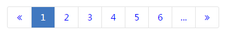
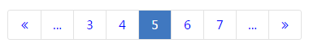

# Example
  


# Usage
```
npm install && npm start
```
I will recommend you to use [`minihost`](https://www.npmjs.com/package/minihost), it makes you convenience

# Params
* `total`: (number) The total number of data
* `size`: (number) Pagesize
* `callback`: (function) handle callback

it looks like:
```js
<Pagination total={100} size={10} callback={func} />
```
